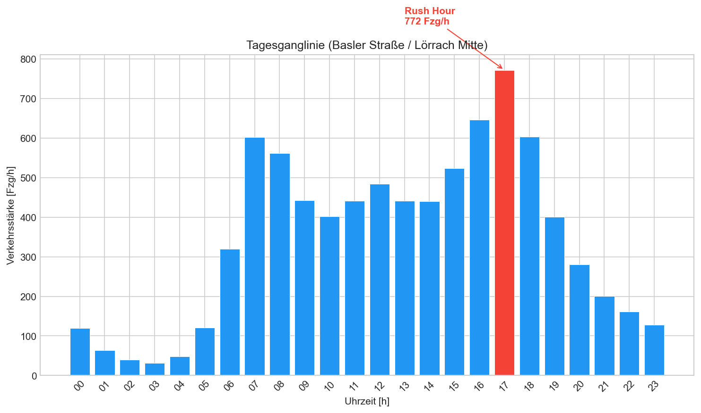
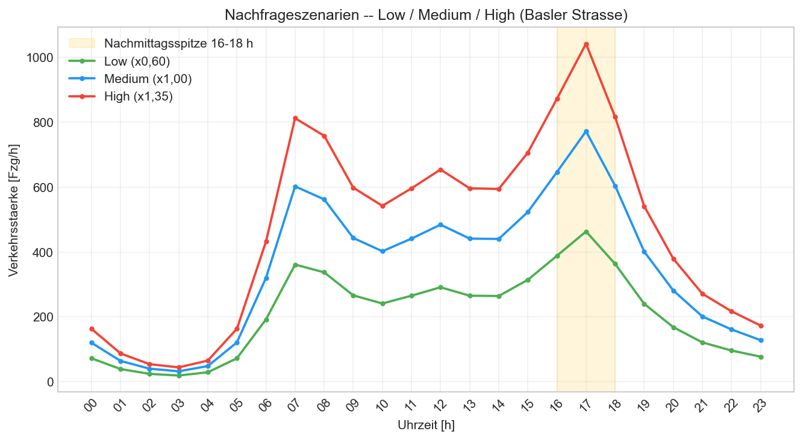

# 3. Daten und Simulationsumgebung

## 3.1 SUMO-Netzwerk

Die Simulation nutzt ein synthetisches 4-armiges Kreuzungsnetzwerk, das die Kreuzung Basler Straße / Lörrach Mitte im mikroskopischen Verkehrssimulator SUMO abbildet. Das Netzwerk umfasst:

- **Basler Straße (Nord-Süd):** 2 Fahrstreifen pro Richtung, Priorität 3, zulässige Höchstgeschwindigkeit 50 km/h
- **Querstraße (Ost-West):** 1 Fahrstreifen pro Richtung, Priorität 2, zulässige Höchstgeschwindigkeit 50 km/h
- **Lichtsignalanlage:** TLS-ID `"C"` (zentraler Knoten), 4 Phasen:
  - Phase 0: Nord-Süd Grün (42 s)
  - Phase 1: Nord-Süd Gelb (3 s)
  - Phase 2: Ost-West Grün (42 s)
  - Phase 3: Ost-West Gelb (3 s)
- **Gesamtzykluszeit:** 90 s (42 + 3 + 42 + 3)

Die asymmetrische Geometrie (2 vs. 1 Spur) spiegelt die reale Hierarchie wider: Die Basler Straße als ehemalige B317 ist die dominierende Nord-Süd-Achse, die Querstraße eine nachgeordnete Gemeindestraße.

## 3.2 Datenbasis und Begründung der synthetischen Modellierung

Die Entscheidung für ein synthetisches Netzwerk statt eines OSM-Imports resultiert aus mehreren Einschränkungen der verfügbaren Datenquellen:

**Umklassifizierung der B317.** Die Basler Straße war bis ca. 2018 Teil der Bundesstraße 317. Im Zuge einer Neuordnung wurde der innerstädtische Abschnitt bei Lörrach als Gemeindestraße umklassifiziert. Damit fiel die Straße aus der bundesweiten Verkehrszählung des BASt heraus. Die nächstgelegene BASt-Dauerzählstelle (Zst 8570) liegt ca. 40 km nördlich bei Schopfheim und weist einen DTV von 18.640 Kfz/24h auf -- ein Wert, der für eine außerörtliche Bundesstraße mit Durchgangsverkehr typisch ist, aber die innerstädtische Situation in Lörrach nach der Umklassifizierung nicht repräsentiert.

**Kommunale Zähldaten.** Die Stadt Lörrach führt eigene Verkehrszählungen durch, die über die Plattform MobiData BW zugänglich sind. Die Zählstelle Lörrach-Stetten (2024) weist einen DTV von **8.037 Kfz/24h** aus. Dieser Wert ist konsistent mit dem erwarteten Rückgang nach der Umklassifizierung: Ohne Bundesstraßen-Status entfällt ein großer Teil des Durchgangsverkehrs, der vorher über die B317 geleitet wurde.

**Fehlende Feinauflösung.** Die MobiData-BW-Daten liefern lediglich aggregierte DTV-Werte als PDF-Berichte, keine maschinenlesbaren Stundenwerte oder richtungsbezogenen Zähldaten. Für eine präzise Kalibrierung wären stündlich aufgelöste Daten pro Zufahrt und Fahrbeziehung notwendig. Diese sind für Lörrach nicht öffentlich verfügbar.

Angesichts dieser Datenlage wurde entschieden, das Netzwerk synthetisch zu modellieren und die Gesamtnachfrage aus dem DTV-Wert der kommunalen Zählung abzuleiten. Die Tagesganglinie wird über eine standardisierte HBS-2015-Kurve disaggregiert (siehe Abschnitt 3.3).

> **Hinweis (Projektverlauf, Hybrid-Strategie).** Das synthetische Netz bildet die *erste* Stufe (Methodenbeweis). In einer späteren Phase wurde die Kreuzung zusätzlich **direkt aus OpenStreetMap importiert** (`netconvert --osm-files`, reale Topologie, TLS-OSM-ID `1628110071`); die **Headline-Ergebnisse in Kapitel 7 beruhen auf diesem OSM-Netz**. Die Abschnitte 3.1-3.3 dokumentieren die synthetische Modellierungs- und Kalibrierungsbasis; Kapitel 7.5 ordnet beide Netze gegeneinander ein.

## 3.3 Kalibrierung der Verkehrsnachfrage

Die Kalibrierung folgt einem dreistufigen Verfahren:

**Schritt 1 -- DTV-Disaggregierung.** Der DTV von 8.037 Kfz/24h wird anhand einer typisierten Tagesganglinie nach HBS 2015 (Handbuch für die Bemessung von Straßenverkehrsanlagen) auf Stundenwerte verteilt. Die HBS-Ganglinie für innerstädtische Hauptverkehrsstraßen zeigt charakteristische Morgen- und Nachmittagsspitzen (ca. 7--9 Uhr und 16--18 Uhr) mit einem Spitzenstundenanteil von ca. 9,6 % des DTV.

**Schritt 2 -- Richtungsverteilung.** Der Gesamtverkehr wird auf die vier Zufahrten verteilt. Die Basler Straße (Nord-Süd) trägt den dominierenden Anteil (~60 %), die Querstraße (Ost-West) den restlichen Anteil (~40 %). Innerhalb jeder Achse wird eine leichte Richtungsasymmetrie angesetzt (55:45), die den typischen Pendlerverkehr in Richtung Stadtmitte morgens und stadtauswärts abends abbildet. Abbiegebeziehungen werden auf Basis von Literaturwerten geschätzt (ca. 40 % geradeaus, 30 % links, 30 % rechts).

**Schritt 3 -- Szenario-Skalierung.** Der kalibrierte Stundenwert für das Medium-Szenario entspricht dem DTV-basierten Profil. Daraus werden drei Szenarien abgeleitet:

| Szenario | Skalierungsfaktor | Rush-Hour-Spitze (ca.) | Typische Situation |
|---|---|---|---|
| Low | 0,60 | ~460 Kfz/h | Wochenende, Nebenzeit |
| Medium | 1,00 | ~770 Kfz/h | Normaler Werktag |
| High | 1,35 | ~1.040 Kfz/h | Starker Berufsverkehr, Umleitung |

Während des Trainings wird pro Episode zufällig eines der drei Szenarien gewählt (Uniform-Verteilung), um Generalisierung über verschiedene Verkehrslagen zu fördern.

*Abbildung 1: Tagesganglinie (Werktag, Medium-Szenario) -- DTV-Disaggregierung nach HBS-2015-Methodik. Absolute Verkehrsstärke pro Stunde [Fzg/h] mit charakteristischen Morgen- (≈ 07 h) und Nachmittagsspitzen (Rush Hour 17 h ≈ 772 Fzg/h).*

*Abbildung 2: Drei Nachfrageszenarien (Low, Medium, High) -- Skalierung des kalibrierten Stundenprofils mit den Faktoren 0,60 / 1,00 / 1,35 (Spitzenstunde ≈ 463 / 772 / 1.042 Fzg/h).*

## 3.4 SUMO-Konfiguration

Die Simulation wird über eine `.sumocfg`-Datei gesteuert, die Netzwerk, Demand und Zusatzdateien referenziert. Zentrale Parameter:

- **Simulationsdauer:** 3.600 s (1 Stunde)
- **Zeitschritt:** 1 s (SUMO-Standard für mikroskopische Simulation)
- **Fahrzeugmodell:** Krauss car-following model (SUMO-Default)
- **Spurwechsel:** LC2013 (SUMO-Default)
- **Teleport-Warnung:** Fahrzeuge, die >300 s stillstehen, werden teleportiert (SUMO-Default) -- dies verhindert kompletten Gridlock, verfälscht aber die Metriken bei Extrembelastung

Für das RL-Training wird der Agent über `sumo-rl` (Alegre, 2019) mit der Simulation gekoppelt. Die Entscheidungsfrequenz beträgt `delta_time = 5 s`, d.h. der Agent wählt alle 5 Sekunden die nächste Grünphase. Details zum RL-Design folgen in Abschnitt 4.
