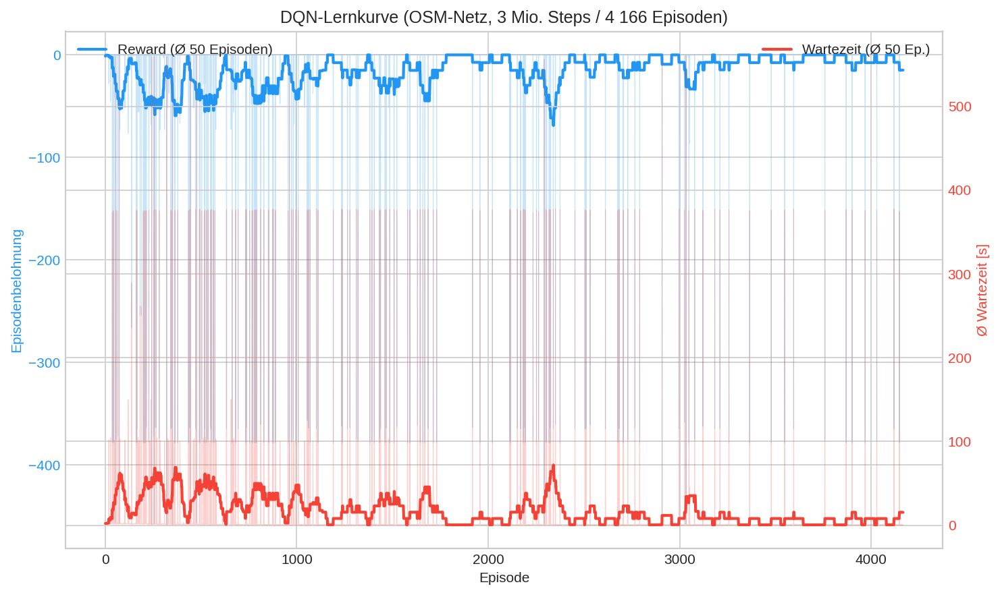

# 6. Training

## 6.1 Hyperparameter

Die Hyperparameter orientieren sich an den Stable-Baselines3-Defaults und werden im zentralen Konfigurationsmodul `src/config/settings.py` als Frozen Dataclasses verwaltet. Tabelle 3 und 4 listen die Werte fuer DQN und PPO.

### DQN

| Parameter | Wert | Beschreibung |
|---|---|---|
| `learning_rate` | $1 \times 10^{-3}$ | Lernrate (SB3-Default) |
| `buffer_size` | 100.000 | Kapazitaet des Replay Buffers |
| `learning_starts` | 10.000 | Warmup-Steps vor erstem Training |
| `batch_size` | 64 | Minibatch-Groesse fuer Updates |
| `gamma` | 0.99 | Diskontierungsfaktor |
| `exploration_fraction` | 0.3 | Anteil der Steps mit Epsilon-Decay |
| `exploration_final_eps` | 0.05 | Minimales Epsilon nach Decay |
| `target_update_interval` | 1.000 | Update-Frequenz des Target Networks |
| `train_freq` | 4 | Trainingsupdate alle 4 Steps |
| `total_timesteps` | 1.000.000 | Default (`DQNConfig`); CLI-Override **3.000.000** für den OSM-Headline-Lauf |

*Tabelle 3: DQN-Hyperparameter (Quelle: `DQNConfig` in settings.py).*

### PPO

| Parameter | Wert | Beschreibung |
|---|---|---|
| `learning_rate` | $3 \times 10^{-4}$ | Lernrate (SB3-Default fuer PPO) |
| `n_steps` | 2.048 | Rollout-Laenge pro Update |
| `batch_size` | 64 | Minibatch-Groesse |
| `n_epochs` | 10 | Epochs pro Rollout |
| `gamma` | 0.99 | Diskontierungsfaktor (konsistent mit DQN) |
| `clip_range` | 0.2 | PPO-Clipping-Parameter |
| `total_timesteps` | 1.000.000 | Default (`PPOConfig`); nur auf dem synthetischen Methodenbeweis-Netz trainiert |

*Tabelle 4: PPO-Hyperparameter (Quelle: `PPOConfig` in settings.py).*

Die Tuning-Strategie verzichtet bewusst auf Grid-Search (zu rechenintensiv fuer ein Solo-Projekt). Stattdessen wird die Learning Rate als sensitivster Parameter in drei Stufen variiert ($10^{-4}$, $10^{-3}$, $10^{-2}$), und der beste Wert wird bei ansonsten festen Defaults uebernommen.

## 6.2 Trainingsprotokoll

Jeder Trainingslauf folgt einem standardisierten Protokoll:

1. **Seeding:** `seed_everything(seed=42)` setzt alle Zufallsquellen (NumPy, PyTorch, Python `random`, CUDA) auf einen deterministischen Ausgangszustand.
2. **Environment-Erstellung:** `make_env()` erzeugt die sumo-rl Gymnasium-Umgebung mit den Parametern aus `SumoConfig` (3600 s Simulation, 300 s Warmup, `delta_time=5`).
3. **Modellinitialisierung:** DQN bzw. PPO wird mit den jeweiligen Hyperparametern instanziiert. Der Policy-Typ ist `MlpPolicy` (vollvernetztes Netz).
4. **Training:** `model.learn(total_timesteps=...)` startet das Training. Die Step-Zahl wird per CLI gesetzt: 1 Mio. fuer den Methodenbeweis (synthetisches Netz), 3 Mio. fuer den Headline-Lauf (OSM-Netz). Waehrend des Trainings werden Metriken via TensorBoard geloggt (ADR #9).
5. **Checkpointing:** Alle 50.000 Steps wird ein Modell-Checkpoint gespeichert (`models/checkpoints/`), um bei Abbruch nicht den gesamten Fortschritt zu verlieren.
6. **Logging:** TensorBoard erfasst: Episode Reward (mean), Episode Length, Value Loss, Policy Loss, Exploration Rate (DQN) bzw. Entropy Loss (PPO).

Das Monitoring erfolgt ueber TensorBoard (`tensorboard --logdir runs/`). Die Trainings-Scripts sind als Standalone-CLI implementiert:

```bash
# Methodenbeweis - synthetisches 4-Arm-Netz, je 1 Mio. Steps (DQN + PPO)
python src/training/train_dqn.py --total-timesteps 1000000 --seed 42 --reward diff-waiting-time
python src/training/train_ppo.py --total-timesteps 1000000 --seed 42 --reward diff-waiting-time

# Headline-Lauf - echtes OSM-Netz, 3 Mio. Steps (DQN)
python src/training/train_dqn.py --total-timesteps 3000000 --seed 42 --reward diff-waiting-time \
  --net-file data/sumo_config/loerrach_osm.net.xml \
  --route-file data/sumo_config/loerrach_osm_medium.rou.xml
```

## 6.3 Trainingsstufen

Das Training erfolgte zweistufig (Hybrid-Strategie, ADR 2026-05-13):

1. **Methodenbeweis** auf dem synthetischen 4-Arm-Netz: **DQN und PPO**, je
   1 Mio. Steps, Reward `diff-waiting-time`. Zweck: belegen, dass die
   RL-Pipeline lernt und die Festzeitschaltung schlägt.
2. **Headline-Lauf** auf dem echten OSM-Netz: **DQN**, 3 Mio. Steps, Reward
   `diff-waiting-time`. Zweck: Fidelitäts-Validierung an realer Straßengeometrie
   (Ergebnisse in Kapitel 7).

## 6.4 Trainingsergebnisse

### Lernkurve (OSM-Netz, DQN 3 Mio. Steps)



*Abbildung 3: Episodischer Reward des DQN-Agenten über 4.166 Episoden
(3 Mio. Steps) auf dem echten OSM-Netz. Der Reward steigt aus einem chaotisch-
negativen Bereich auf ein stabiles Niveau; **Konvergenz ab ≈ Episode 2.500**,
kein Reward-Kollaps. Die verbleibenden negativen Spitzen entsprechen den
Gridlock-Seeds (vgl. Kapitel 7).*

### Konvergenzanalyse (synthetisches Netz, 1 Mio. Steps)

Auf dem synthetischen Methodenbeweis-Netz lässt sich das Konvergenzverhalten
beider Algorithmen direkt vergleichen. Tabelle 5 zeigt den mittleren Reward je
200k-Step-Fenster.

| Step-Fenster | DQN Reward (Ø ± Std) | PPO Reward (Ø ± Std) |
|---|---|---|
| 0-200k | -112,3 ± 19,8 (Lernphase) | -76,8 ± 8,7 (schnelle Konvergenz) |
| 200-400k | -77,6 ± 6,8 (konvergiert) | -75,6 ± 0,39 (deterministisch) |
| 400-600k | -73,9 ± 3,4 (konvergiert) | -75,6 ± 0,16 (deterministisch) |
| 600-800k | -74,0 ± 3,4 (stabil) | -75,5 ± 0,42 (deterministisch) |
| 800k-1M | -74,0 ± 3,1 (stabil) | -75,6 ± 0,18 (deterministisch) |

*Tabelle 5: Reward-Konvergenz je 200k-Fenster, synthetisches Netz, Seed 42.*

**Befunde:**

- **DQN** durchläuft eine deutliche Lernphase und **konvergiert ab ≈ 400k Steps**
  auf ein stabiles Plateau; keine spätere Verbesserung von 400k bis 1 Mio.
- **PPO** konvergiert sehr früh (≈ 50k) und **kollabiert bis ≈ 200k zu einer
  praktisch deterministischen Policy** (Reward-Std fällt auf 0,16-0,42). Die
  fast verschwindende Varianz zeigt eine eingefrorene Politik - ein valides,
  dokumentiertes Ergebnis (kein Bug), das den geringeren Explorationsspielraum
  von PPO unter diesem Reward illustriert.
- Auf dem **größeren OSM-Netz** (3 Mio. Steps) konvergiert DQN entsprechend
  später (≈ Episode 2.500, siehe Abbildung 3) - die komplexere reale Topologie
  erfordert mehr Erfahrung.

### Trainingszeit und Hardware

Das Training ist **simulationsgebunden** (SUMO-Mikrosimulation via TraCI), nicht
GPU-limitiert: Das kleine MLP-Policy-Netz lastet keine GPU aus, der Engpass ist
der SUMO-Schritt. Tabelle 6 listet die Reproduktionsumgebung des Headline-Laufs.

| Komponente | Wert |
|---|---|
| Betriebssystem | Linux (x86-64) |
| CPU | AMD Ryzen 5 3600 |
| GPU | AMD Radeon RX 7800 XT (kaum genutzt - simulationsgebunden) |
| Python | 3.11 |
| SUMO | Eclipse SUMO 1.18.0 (TraCI; `libsumo` nicht installiert) |
| Kernpakete | gymnasium 0.29.1, sumo-rl 1.4.5, stable-baselines3 2.3.2, numpy < 2.0 |

*Tabelle 6: Reproduktionsumgebung des OSM-Headline-Laufs.*

| Lauf | Netz | Steps | Episoden | Wall-Clock |
|---|---|---|---|---|
| DQN (Methodenbeweis) | synthetisch 4-Arm | 1 Mio. | 1.388 | ≈ 10 h (CPU)¹ |
| PPO (Methodenbeweis) | synthetisch 4-Arm | 1 Mio. | 1.390 | ≈ 10 h (CPU)¹ |
| **DQN (Headline)** | **echtes OSM** | **3 Mio.** | **4.166** | **≈ 5,2 h** |

*Tabelle 7: Trainingsdauer pro Lauf.*
¹ Vorläufige Methodenbeweis-Läufe (2026-04-03) auf separater Hardware/Datum; da
die Laufzeit von Maschine und SUMO-Version abhängt, sind die absoluten Stunden
zwischen den Stufen nicht direkt vergleichbar - der gemeinsame Engpass ist die
TraCI-Mikrosimulation.
