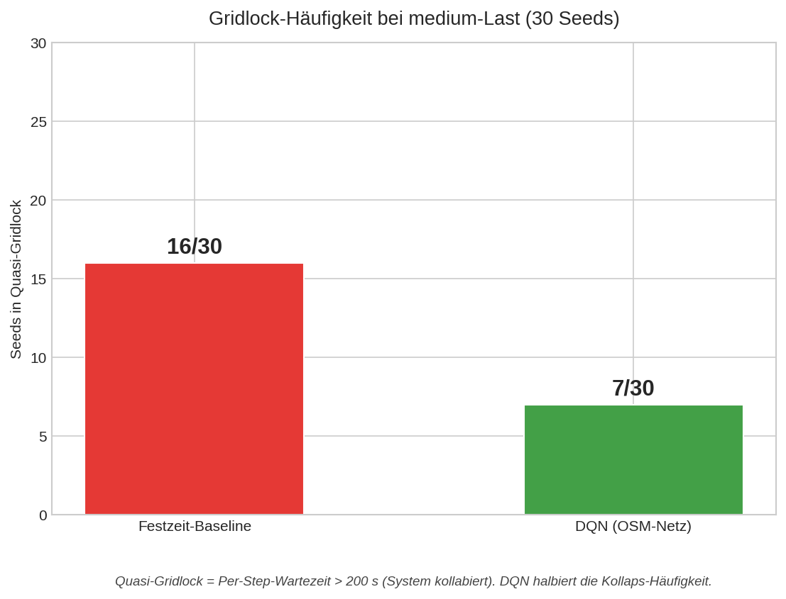
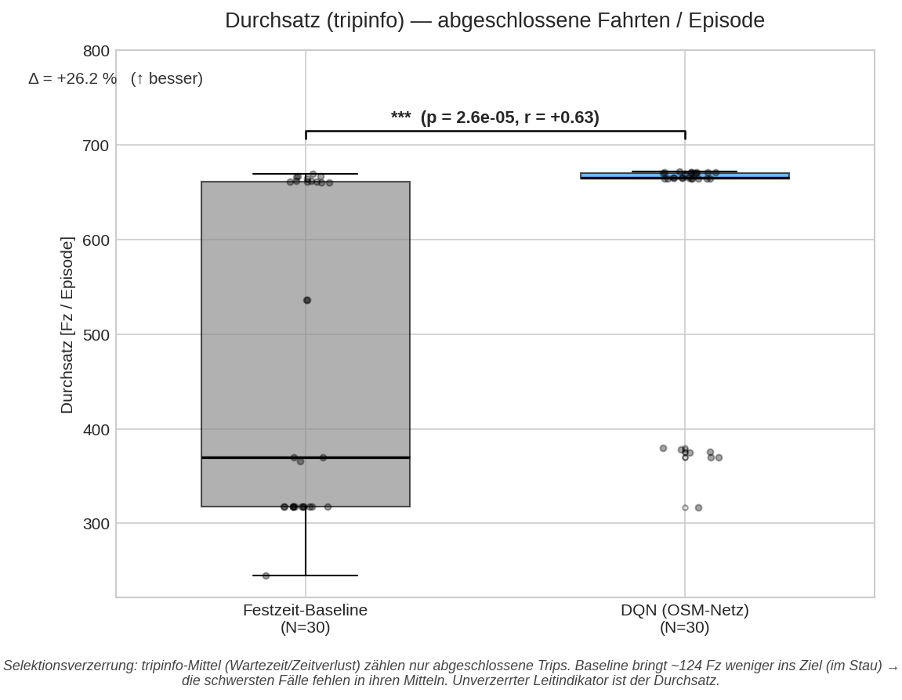
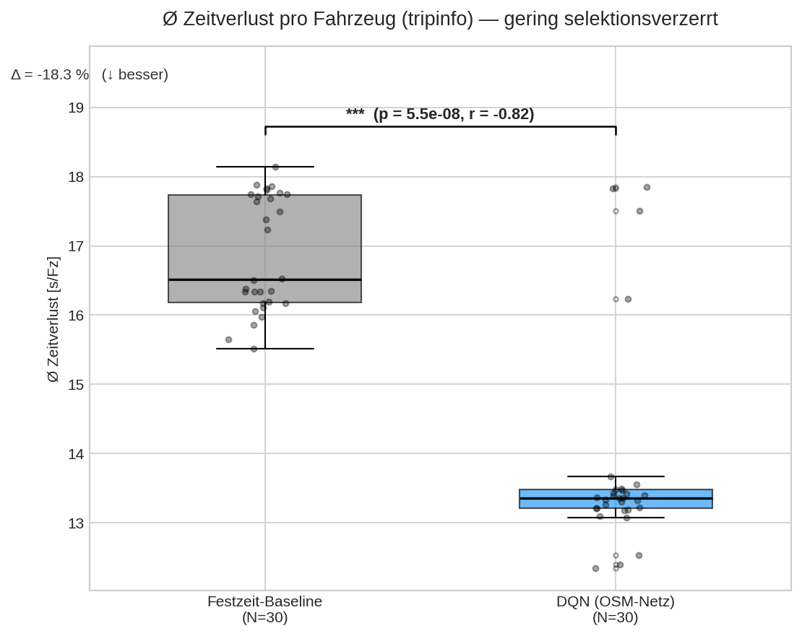
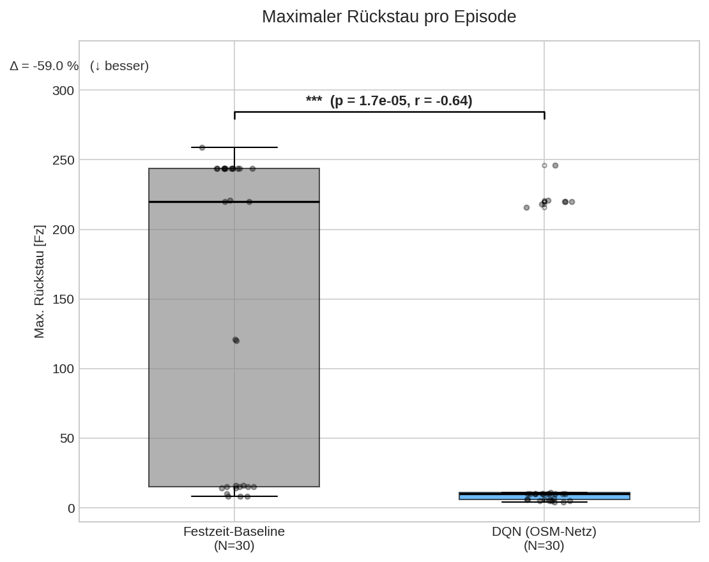
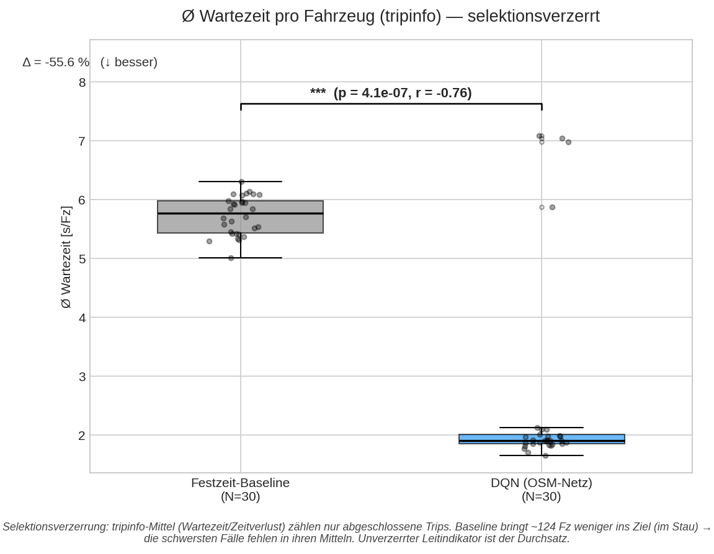
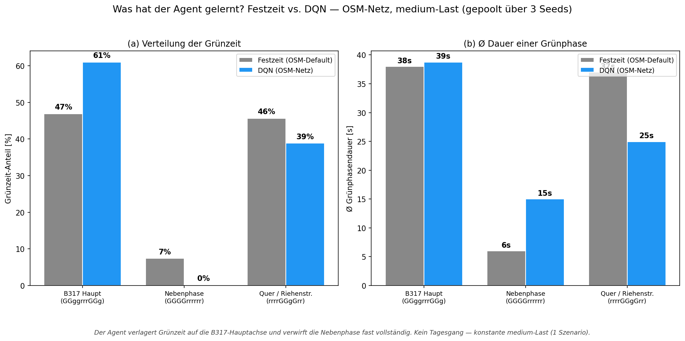

# 7. Evaluationsergebnisse

Die Auswertung folgt der zweistufigen DASC-PM-Strategie (vgl. Kapitel 4 und 6): Das
synthetische 4-Arm-Netz dient als Methodenbeweis, das aus OpenStreetMap importierte Netz
als Fidelitäts-Validierung an realer Geometrie. Tabelle 8 fasst beide Stufen zusammen,
bevor Abschnitt 7.2 die Headline-Ergebnisse im Detail berichtet.

*Tabelle 8: Überblick der zweistufigen Evaluationsstrategie.*

| Netz | Rolle | Trainiert | Kern-Ergebnis |
|---|---|---|---|
| Synthetisches 4-Arm-Netz | Methodenbeweis | DQN + PPO, je `diff-waiting-time` + `pressure`, 1 Mio. Steps | RL schlägt die Festzeit klar (-88 % Per-Step-Wartezeit, p = 0,0002); der Durchsatz-Effekt bleibt jedoch trivial (+0,3 %), da das idealisierte Netz unterausgelastet ist |
| Echtes OSM-Netz (Headline) | Fidelitäts-Validierung | DQN, `diff-waiting-time`, 3 Mio. Steps | **+26 % Durchsatz** (p = 2,6·10⁻⁵, r = +0,63), alle 7 KPIs signifikant, Quasi-Gridlock 16/30 → 7/30 Seeds |

Eine frühere, schema-verankerte Zwischenvariante des realen Netzes (`loerrach_real`) wurde
durch den direkten OSM-Import ersetzt; ihre vorläufige Durchsatzkennzahl wurde als
Messartefakt zurückgezogen (siehe `README.md`).

## 7.1 Evaluationsprotokoll

Die Evaluation folgt einem standardisierten, reproduzierbaren Protokoll. Agent
(DQN) und Baseline (Festzeit) werden unter identischen Bedingungen getestet:

- **Anzahl Seeds:** $N = 30$ unabhängige Seeds (0-29, `TrainingConfig.eval_seeds`)
  pro Verfahren. Der Trainings-Seed (42) ist **nicht** in den Eval-Seeds enthalten.
- **Episodenkonfiguration:** identisch zum Training - 3600 s Simulationszeit,
  300 s Warmup, `delta_time = 5 s` → 720 RL-Schritte pro Episode.
- **Deterministische Evaluation:** Während der Evaluation ist die Exploration
  deaktiviert ($\epsilon = 0$, deterministische Policy).
- **Netz:** echtes OSM-importiertes Netz `loerrach_osm.net.xml` (TLS-ID
  `1628110071`), medium-Last (681 geladene Trips/Episode).
- **Baseline:** das aus OSM importierte **Default-Festzeitprogramm**
  (`fixed_ts=True`, 90 s Zyklus) - ein realistischer, aber **un-tuned** Vergleich
  (kein hand-optimierter Webster-Plan; siehe Limitierungen, Kapitel 8).

### KPI-Definitionen

Es werden zwei Klassen von Kenngrößen unterschieden (Audit-Befunde B4/B5/F1):

| KPI | Typ | Definition | Einheit | Richtung |
|---|---|---|---|---|
| `avg_waiting_time` | per-step | sumo-rl Systemwartezeit über alle Fahrzeuge je RL-Schritt | (System) | niedriger = besser |
| `max_queue_length` | per-step | maximale Warteschlangenlänge über alle Spuren | Fahrzeuge | niedriger = besser |
| `avg_speed` | per-step | mittlere Geschwindigkeit aller Fahrzeuge je Schritt | m/s | höher = besser |
| `total_throughput` | tripinfo | abgeschlossene Fahrten pro Episode (SUMO `--tripinfo-output`) | Fz/Episode | höher = besser |
| `tripinfo_mean_waiting_time` | tripinfo | Wartezeit **pro abgeschlossenem Fahrzeug** | s/Fz | niedriger = besser |
| `tripinfo_mean_duration` | tripinfo | Reisezeit pro abgeschlossenem Fahrzeug | s/Fz | niedriger = besser |
| `tripinfo_mean_time_loss` | tripinfo | Zeitverlust ggü. Freifahrt pro abgeschlossenem Fahrzeug | s/Fz | niedriger = besser |

> **Lesehilfe (Audit B5):** *Per-Step*-Größen sind sumo-rl-Systemwerte über alle
> Fahrzeuge je RL-Schritt - **nicht** Sekunden pro Fahrzeug; nur der **relative**
> Vergleich ist aussagekräftig. **Absolut belastbar** pro Fahrzeug sind nur die
> *tripinfo*-Größen - mit dem in Kapitel 7.4 erklärten Selektions-Vorbehalt.

## 7.2 Ergebnisse (echtes OSM-Netz, DQN 3 Mio. Steps)

Der Agent **DQN** mit `diff-waiting-time`-Reward wurde über **3.000.000 Steps**
(4.166 Episoden, ≈ 5,2 h, Konvergenz ab ≈ Episode 2.500) trainiert und über
30 Seeds gegen die importierte Festzeit-Steuerung evaluiert.

*Tabelle 9: KPI-Vergleich (Mittelwert ± Std über $N=30$ Seeds), OSM-Netz,
medium-Last. Mann-Whitney U (zweiseitig, $\alpha=0{,}05$), r = rank-biserial.*

| KPI | Typ | Festzeit | DQN | Δ rel. | p-Wert | r | sig. |
|---|---|---|---|---|---|---|---|
| Ø Wartezeit | per-step | 289 ± 262 | 93,9 ± 172 | **-67,5 %** | 7,0·10⁻⁷ | -0,75 | ja |
| Max. Rückstau [Fz] | per-step | 141 ± 109 | 58,0 ± 91 | **-59,0 %** | 1,7·10⁻⁵ | -0,64 | ja |
| Ø Geschwindigkeit [m/s] | per-step | 4,26 ± 2,54 | 6,57 ± 2,06 | **+54,1 %** | 2,6·10⁻⁷ | +0,78 | ja |
| **Durchsatz** [Fz/Episode] | tripinfo | 473 ± 165 | **597 ± 128** | **+26,2 %** | 2,6·10⁻⁵ | +0,63 | ja |
| Ø Wartezeit/Fz [s] | tripinfo | 5,73 ± 0,32 | 2,54 ± 1,66 | **-55,6 %** | 4,1·10⁻⁷ | -0,76 | ja |
| Ø Reisezeit/Fz [s] | tripinfo | 67,7 ± 2,2 | 65,6 ± 1,3 | -3,1 % | 2,1·10⁻³ | -0,46 | ja |
| Ø Zeitverlust/Fz [s] | tripinfo | 16,9 ± 0,8 | 13,8 ± 1,5 | **-18,3 %** | 5,5·10⁻⁸ | -0,82 | ja |

**Befund:** Alle sieben KPIs unterscheiden sich statistisch signifikant
zugunsten des DQN-Agenten (Effektgrößen $|r| = 0{,}46$-$0{,}82$, mittel bis
groß). Der **Durchsatz steigt um +26,2 %**, die **Abschlussquote von 69,5 %
auf 87,7 %** der 681 geladenen Trips.

### Gridlock-Stabilisierung

Der praxisrelevanteste Befund: Die Festzeit-Steuerung läuft in **16 von 30
Seeds** in einen Quasi-Gridlock (Per-Step-Wartezeit > 200 s, der Knoten
kollabiert), der DQN-Agent nur in **7 von 30**. Das reale Netz ist bei
medium-Last **kapazitätskritisch**; der Agent halbiert die Kollaps-Häufigkeit
und nutzt die Knotenkapazität deutlich besser. Sichtbar als bimodale
Festzeit-Verteilung im Durchsatz-Boxplot vs. eng am Maximum geclusterter
DQN-Verteilung.

*Abbildung 4: Anzahl der Seeds in Quasi-Gridlock (Per-Step-Wartezeit > 200 s).
Festzeit 16/30, DQN 7/30 - die Kollaps-Häufigkeit ist halbiert.*

### Lernkurve

Die Lernkurve des Headline-Laufs ist in Kapitel 6 dargestellt (Abbildung 3): Der
Reward steigt aus einem chaotisch-negativen Bereich auf ein stabiles Niveau
(Konvergenz ab ≈ Episode 2.500, kein Reward-Kollaps); die verbleibenden negativen
Spitzen entsprechen den Gridlock-Seeds.

### KPI-Boxplots

*Abbildung 5: Durchsatz (tripinfo) - der unverzerrte Leitindikator. Die
bimodale Festzeit-Verteilung (Cluster bei ≈ 660 und ≈ 318 Fz) zeigt die
Gridlock-Seeds; der DQN-Agent clustert eng am Maximum. +26,2 %, p = 2,6·10⁻⁵,
r = +0,63.*

*Abbildung 6: Ø Zeitverlust pro Fahrzeug (tripinfo) - gering selektionsverzerrt,
da auch verzögerte (nicht nur staufreie) Trips erfasst werden. -18,3 %,
p = 5,5·10⁻⁸, r = -0,82.*

*Abbildung 7: Maximaler Rückstau pro Episode. -59,0 %, p = 1,7·10⁻⁵.*

*Abbildung 8: Ø Wartezeit pro Fahrzeug (tripinfo) - **selektionsverzerrt**
(siehe 7.4). Die winzige Festzeit-Streuung (±0,32 s) trotz riesiger Per-Step-
Streuung (±262 s) ist das Verräterindiz der Verzerrung.*

### Was hat der Agent gelernt?

*Abbildung 9: Gelernte Grünzeit-Verteilung vs. importiertes Festzeitprogramm.
Der Agent verlagert Grünzeit auf die B317-Hauptachse (47 % → 61 %), verwirft
die Nebenphase (`GGGGrrrrrr`) fast vollständig (7 % → 0 %) und schaltet die
Querstraße in kürzeren, reaktiveren Grünphasen (Ø 37 s → 25 s). Kein Tagesgang
- konstante medium-Last (ein Szenario).*

## 7.3 Statistische Validierung

Die statistische Signifikanz wird mit dem **Mann-Whitney U Test** geprüft -
einem nicht-parametrischen Test, der keine Normalverteilungsannahme erfordert
und für die typischerweise schiefverteilten (hier sogar **bimodalen**)
Wartezeiten geeignet ist (Mann & Whitney, 1947).

### Testdesign

- **Nullhypothese $H_0$:** Die KPI-Verteilungen von Agent und Baseline stammen
  aus derselben Population (kein Unterschied).
- **Alternativhypothese $H_1$:** Die Verteilungen unterscheiden sich (zweiseitig).
- **Signifikanzniveau:** $\alpha = 0{,}05$
- **Stichprobengröße:** $n_1 = n_2 = 30$ (je 30 Seeds)

### Effektstärke

Neben der Signifikanz wird die praktische Bedeutsamkeit über die
**rank-biseriale Korrelation** $r$ berichtet:

$$r = 1 - \frac{2U}{n_1 \cdot n_2}$$

Interpretation nach Wendt (1972): $|r| < 0{,}3$ klein, $0{,}3 \le |r| < 0{,}5$
mittel, $|r| \ge 0{,}5$ groß. Die hier erreichten $|r| = 0{,}46$-$0{,}82$
entsprechen mittleren bis großen Effekten.

> **Methodischer Gewinn gegenüber dem synthetischen Netz:** Am idealisierten
> 4-Arm-Kreuz (Methodenbeweis, Kapitel 7.5) waren die Verteilungen vollständig
> getrennt ($|r| = 1{,}0$, $U = 0$ bzw. $900$) - statistisch „zu perfekt". Erst
> die reale OSM-Geometrie liefert mit $|r| < 1$ glaubwürdige, überlappende
> Verteilungen und macht den Kapazitätsgewinn überhaupt messbar.

## 7.4 Selektionsverzerrung der tripinfo-Mittel (verbindliche Einordnung)

`tripinfo` erfasst **nur abgeschlossene Fahrzeuge**. Da die Festzeit-Baseline
~124 Fahrzeuge weniger ins Ziel bringt (die im Stau steckenden), fehlen genau
die am stärksten betroffenen Fahrzeuge in ihren tripinfo-Mitteln. Das
Verräterindiz: die **winzige Streuung der Festzeit-Wartezeit/Fz (±0,32 s)**
trotz riesiger Per-Step-Streuung (±262 s) - die Baseline „berichtet" nur über
die Fahrzeuge, die es durch den Knoten geschafft haben.

**Konsequenz:** Die per-Fahrzeug-Reisezeit (-3,1 %) und -Wartezeit (-55,6 %)
**unterschätzen** den wahren Effekt, weil der DQN-Agent zusätzlich die „schweren"
Fahrzeuge abarbeitet, die die Baseline liegen lässt. Der **unverzerrte
Leitindikator ist deshalb der Durchsatz (+26 %)**; der Zeitverlust (-18,3 %) ist
geringer verzerrt als die Wartezeit, da er auch verzögerte Trips bewertet.

## 7.5 Einordnung Hybrid-Strategie

Gemäß ADR vom 2026-05-13 dient das **synthetische 4-Arm-Netz als Methodenbeweis**
(DQN + PPO, je `diff-waiting-time` und `pressure`, 1 M Steps, -88 % Per-Step-
Wartezeit, p = 0,0002), während das **echte OSM-Netz die Fidelitäts-Validierung**
liefert. Das saubere Kreuz war zur Durchsatz-Frage uninformativ (fast alle
Fahrzeuge kommen ohnehin an, Durchsatz-Effekt +0,3 %); erst die reale Geometrie
macht den Kapazitätsgewinn der RL-Steuerung messbar (+26 %). Vollständige
Rohdaten und Validitäts-Einordnung: `results/OSM_NETWORK_RESULTS.md`.

> Alle in diesem Kapitel zitierten Quellen sind im zentralen Literaturverzeichnis (`10_references.md`) gelistet.
